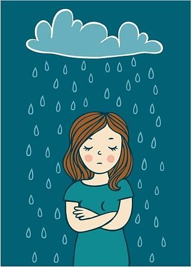

# Mood

>Eighteen minutes later,五月的某个城市是温热温热的，反复变化的天气映射着每天出现在城市轨道交通运输工具上的人群，时而多：等待下一波，时而少：停留这一波。

>键盘敲击噔噔.......大小风扇呼呼......窗外月光凉凉......
>
>叙故事，早已没有青春时候的热情高涨，描现状，由不得从何时开始的月色朦胧🦌。平淡的时光却想着做不一样的事情，是想在习近平新时代中国特色社会主义思想的指导下为国家在科技创新引领世界跨出历史的一步呢？还是想在网红的行为指导下成为下一个流量风口呢？还是想和身边的亲人、朋友、同学安静的相知相守呢？可能在不同的场景下你有很多的想法，不仅仅是前面列举的几个，有想法很好，空想、理想、创想、冥想、思想、多想。。。思有所为，不思不为，如刘邦、李斯、嬴政、雍正、某马、某东等等。他们的故事或许你知道，或者你还不知道，知道的可以客观的重温他们的故事，不知道的可以去了解了解他们的故事，求同存异，他的故事已成过去不可克隆，你的故事正在变成他的故事（有着这种想法也是蛮好的嘛，不怕万一就怕有一天的一万！😂）
>
>未完待续～～～～～～晚安😴