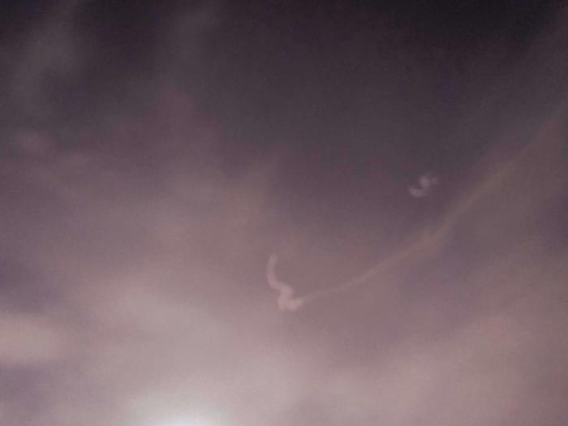

# The night sky

> 1. 天台的夜景很不错嘛！皓月当空、🌟亮堂、按计划路过头顶这片天的✈️、空旷的场地、吹着让人心情放松的nature wind，就差一把藤椅，一杯🍷，品酒仰空论几何～
> 2. 匆匆的脚步带进闷热的狭小空间，此境变成热腾的风消散在该空间里。稳住燥热、放飞思绪、扩张🎵律动感
> 3. 一步一步，似魔鬼的步伐，在这光滑的地面上我摩擦🎶🎶🎶🎶🎶欢快的旋律、小清新、炸裂的拍子能让人每个关节都跟随跳动。音乐，一种听觉享受，歌剧表演有时候比单纯的演唱会更能引起共鸣吧，某城市经常能看到或者听到某某某在该站的巡回演唱会，噢～～～原来是这个明星啊，不过不是很喜欢，不太了解某某某，一辈子有很多一定要做的事情：一定要去攀珠峰，一定要听演唱会，一定要尝美食，一定要游列国等等等。时间有限，客观因素又太多，导致不能逐一的实现，能实现的就尽量去做吧，至少安静的沙漠里不止你一个人在发呆。。。。
> 4. share your story，It's your call，but I'm ready to listen++++

